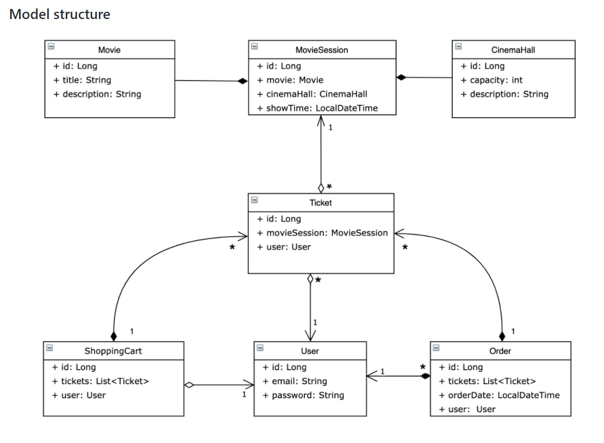

# Cinema Application 

### This is my project for Tickets and Movie Theaters

The application this functionality of end points:

*  /registration, /login - for all visitors of the app
* get all /cinema-halls, /movies, /movie-sessions/available - for visitors with roles User and Administrator
* View shopping cart /shopping-carts/by-user or order history /orders - for Users
* /cinema-halls, /movies, /movie-sessions add a cinema-hall, movie or movie session - for Administrators
* /orders/complete to make an order - for User
* /movie-sessions/{id} update movie sessions - for Administrator
* add, remove ticket from shopping cart - for User
* /movie-sessions/{id} delete movie session - for Administrator

The scheme of the database:

The project was created using these technologies:

* Java 11
* MySQL
* Maven
* Javax Servlet Api
* Spring Security, MVC
* Hibernate
* Tomcat 9.0.50 (to run app locally)
* Jackson - JSON

**Launch**

To run this project:

- install MySQL
- install Tomcat 9.0.50
- fork this project and clone it
- set properties of your DB using db.properties file
- run this project using Tomcat's local server

